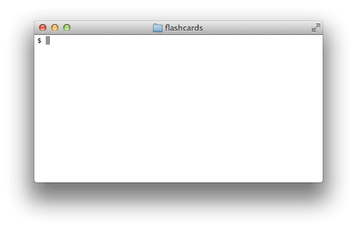

# Ruby Flashcards

## Summary 
We're going to build a flashcard application that functions like the application shown in Figure 1—it's not necessary to build an exact copy.  As always, write elegant, object-oriented code, thinking through design decisions and making judgements on the best courses of action.

  
*Figure 1*.  Example flashcard implementation.

### Model-View-Controller
We're going to design our code to follow the [Model-View-Controller][wikipedia mvc] (MVC) [design pattern][wikipedia design pattern].  Before we begin with the releases, ensure we can answer the following questions.

- What does a model represent?
- How is the view used?
- What is the responsibility of a controller?

## Releases
### Pre-release: Describe and Design the Application
Before we begin to code, let's agree on what we're building.  From loading the data in a file to checking if a guess is correct, what does playing a deck of flashcards look like?  What all needs to happen?   As was stated in the *Summary*, our application should function like the example in Figure 1, but it does not need to be an exact copy—for example, we might want to allow users multiple guesses per card.

Once we have a solid understanding of what needs to happen, develop a design for the application.  We should be able to draw or write a rough sketch of the objects we anticipate needing (i.e., our data models), how they interact, and the overall flow of our program.

This release should take roughly 15 - 20 minutes.  If it's taking longer, find an instructor to get unstuck.

### Release 0: Build Following Model-View-Controller Pattern
Once we're on the same page regarding the design of our flashcard application, it's time to build it.  We have a few example data files (e.g., `nighthawk_flashcard_data.txt`), and a user should be able to play any of these files.

As best we can, follow the MVC design pattern.  Our implementation will likely differ from our cohort mates' implementations; that's okay.  The important thing to consider is how well we structure our code to represent the abstract concept of a design pattern.

*Note:* Here's an [example MVC implementation][] for a hospital-related application.

## Conclusion
Reflect back on the decisions we made in completing this challenge.  How did the design decisions that we made in the *Pre-release* hold up as we began to develop our application?  Did they facilitate the MVC design pattern?  What changed and what remained from our original design?  

How flexible is our code?  Is it easily adaptable?  If we made changes to our code, how many objects would need to be modified?  For example, what if we wanted to support multiple choice questions?  What if we changed the data store file?

What learnings can we take forward and apply to our future code?

[example mvc implementation]:  readme-assets/mvc-hospital-example.md
[wikipedia design pattern]: http://en.wikipedia.org/wiki/Software_design_pattern
[wikipedia mvc]: http://en.wikipedia.org/wiki/Model%E2%80%93view%E2%80%93controller

